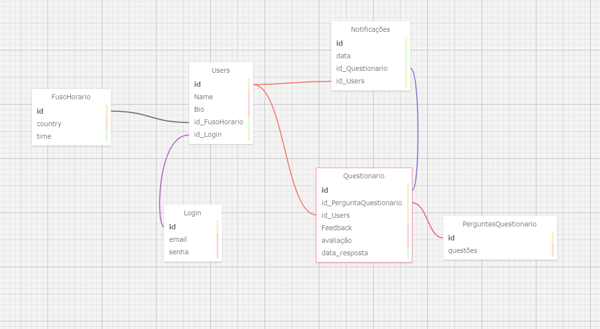

# Ponderada_Prog
 Ponderada refeente ao Modelo Relacional

 ## Cardinalidade 

&nbsp;&nbsp;&nbsp;&nbsp;A relação dos Users com as notificações é de 1 : N uma vez que podem haver várias notificações para um só usuário
A relação de User com Fuso Horário é de 1: 1 uma vez que há só um fuso para cada usuário
A relação do Login Usuário é de 1:1 uma vez que só há um login para cada usuário
A relação do Questionário e os Usuários a relação é de n:1 uma vez que são vários questionários para um usuário
A relação de Notificações com o Questionário é de  1: 1uma vez que será um questionário para cada notificação. 
Por fim, a relação de Questionário com as PerguntasQuestionário será de n:1 uma vez que serão várias perguntas para cada questionário.

## Conexões entre chaves primárias e estrangeiras

**id_Questionario**
&nbsp;&nbsp;&nbsp;&nbsp;é uma chave estrageira que liga as informações do banco de dados relacionado aos questionários tanto nas notificações quanto aos usuários através do ID.

**id_Users**
&nbsp;&nbsp;&nbsp;&nbsp;é uma chave estrageira que liga as informações do banco de dados relacionado aos Users  tanto nas notificações quanto aos questionários através do ID.

**id_FusoHorario**
&nbsp;&nbsp;&nbsp;&nbsp;é uma chave estrageira que liga as informações do banco de dados relacionado ao Fuso horário aos Usuários através do ID.

**id_Login**
&nbsp;&nbsp;&nbsp;&nbsp;é uma chave estrageira que liga as informações do banco de dados relacionado ao Login aos Usuários através do ID.

**id_PergunstaQuestionario**
&nbsp;&nbsp;&nbsp;&nbsp;é uma chave estrageira que liga as informações do banco de dados relacionado as Perguntas dos questionários  aos mesmos através do ID.

<td align="center">
    <a href="#">
        
</a>
</td>

```sql
CREATE TABLE Users (
    id INT AUTO_INCREMENT,
    Name VARCHAR(255),
    Bio MEDIUMTEXT,
    id_FusoHorario TIME,
    id_Login INT DEFAULT NULL,
    PRIMARY KEY (id),
    FOREIGN KEY (id_FusoHorario) REFERENCES FusoHorario(id),
    FOREIGN KEY (id_Login) REFERENCES Login(id)
);

CREATE TABLE Login (
    id INT AUTO_INCREMENT,
    email VARCHAR(255),
    senha VARCHAR(255),
    PRIMARY KEY (id)
);

CREATE TABLE FusoHorario (
    id INT AUTO_INCREMENT,
    country VARCHAR(255),
    time TIME,
    PRIMARY KEY (id)
);

CREATE TABLE PerguntasQuestionario (
    id INT AUTO_INCREMENT,
    questões MEDIUMTEXT,
    PRIMARY KEY (id)
);

CREATE TABLE Questionario (
    id INT AUTO_INCREMENT,
    id_PerguntaQuestionario INT DEFAULT NULL,
    id_Users INT DEFAULT NULL,
    Feedback MEDIUMTEXT,
    avaliação MEDIUMTEXT DEFAULT NULL,
    data_resposta DATETIME,
    PRIMARY KEY (id),
    FOREIGN KEY (id_PerguntaQuestionario) REFERENCES PerguntasQuestionario(id),
    FOREIGN KEY (id_Users) REFERENCES Users(id)
);

CREATE TABLE Notificações (
    id INT AUTO_INCREMENT,
    data DATETIME,
    id_Questionario INT,
    id_Users INT,
    PRIMARY KEY (id),
    FOREIGN KEY (id_Questionario) REFERENCES Questionario(id),
    FOREIGN KEY (id_Users) REFERENCES Users(id)
);
```
